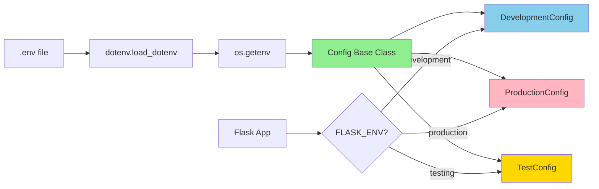
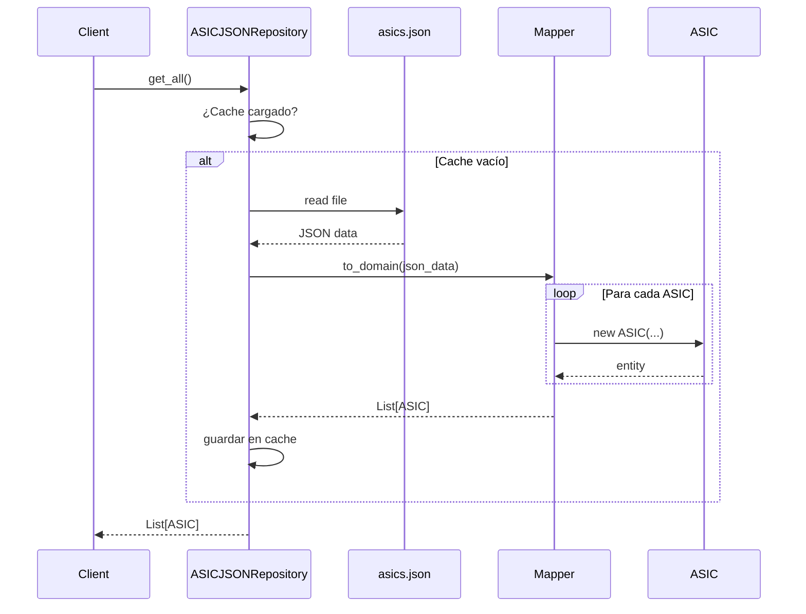
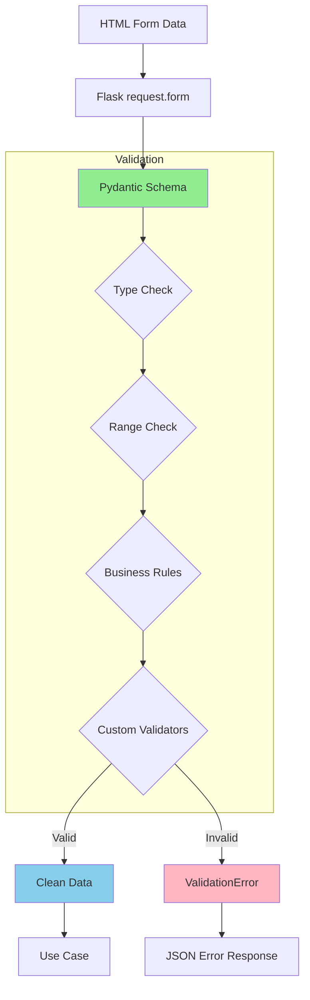
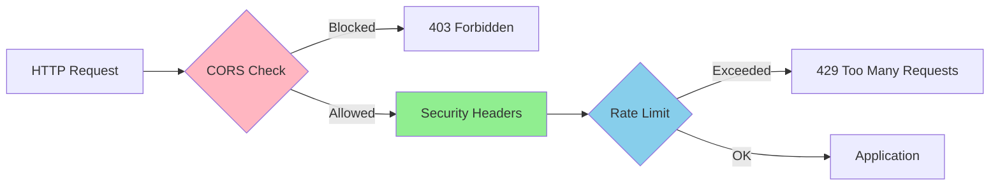
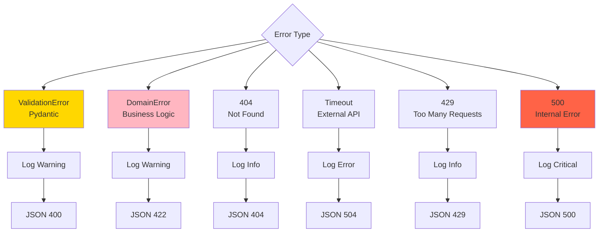
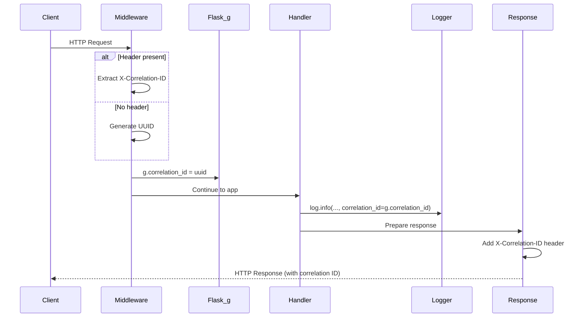
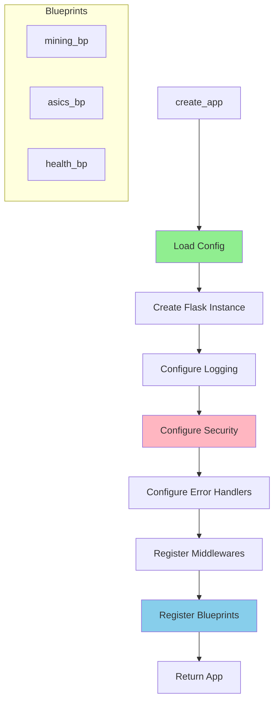

# 🚀 GUÍA DETALLADA - Sprint 1: Fundamentos Arquitectónicos

**Objetivo General:** Transformar arquitectura monolítica en Clean Architecture sin romper funcionalidad  
**Duración Estimada:** 10-14 días (80-112 horas)  
**Prioridad:** 🔴 CRÍTICA  
**Enfoque:** Incremental, testeable, reversible

---

## 📊 DIAGRAMA DE ARQUITECTURA OBJETIVO

```mermaid
graph TB
    subgraph "PRESENTATION LAYER"
        HTTP[HTTP Request] --> MW[Middleware Stack]
        MW --> VALID[Pydantic Validation]
        VALID --> CTRL[Controllers]
        CTRL --> RESP[JSON Response]
    end
    
    subgraph "APPLICATION LAYER"
        CTRL --> UC[Use Cases]
        UC --> ORCH[Orchestration Logic]
    end
    
    subgraph "DOMAIN LAYER"
        ORCH --> ENT[Entities]
        ORCH --> RULES[Business Rules]
        UC --> REPO_INT[Repository Interfaces]
    end
    
    subgraph "INFRASTRUCTURE LAYER"
        REPO_INT --> REPO_IMPL[Repository Implementations]
        REPO_IMPL --> JSON[(JSON Files)]
        UC --> API_CLIENT[External API Clients]
        API_CLIENT --> EXT[CoinGecko, Blockchain.info]
    end
    
    style "DOMAIN LAYER" fill:#90EE90
    style "APPLICATION LAYER" fill:#87CEEB
    style "INFRASTRUCTURE LAYER" fill:#FFB6C1
    style "PRESENTATION LAYER" fill:#FFD700
```

---

## 📁 ESTRUCTURA DE ARCHIVOS COMPLETA

```
BP-8Blocks/
├── .env                            # ⚙️ Variables de entorno (gitignored)
├── .env.example                    # 📝 Template de configuración
├── .gitignore                      # 🚫 Archivos ignorados
├── config.py                       # ⚙️ Configuración centralizada
├── pytest.ini                      # 🧪 Configuración de tests
├── requirements.txt                # 📦 Dependencias Python
├── app.py                          # 🚀 Application Factory (NUEVO)
├── app_legacy.py                   # 📜 Código original (respaldo)
│
├── src/                            # 🏗️ Código fuente principal
│   ├── __init__.py
│   │
│   ├── domain/                     # 💎 Capa de Dominio (Lógica pura)
│   │   ├── __init__.py
│   │   ├── entities/               # Entidades de negocio
│   │   │   ├── __init__.py
│   │   │   ├── asic.py            # 🖥️ ASIC entity
│   │   │   ├── mining_farm.py     # 🏭 MiningFarm entity
│   │   │   ├── network_state.py   # 📡 BitcoinNetworkState
│   │   │   └── simulation.py      # 📊 SimulationParams & Result
│   │   ├── repositories/           # Interfaces de repositorios
│   │   │   ├── __init__.py
│   │   │   ├── asic_repository.py # 🔌 ASIC repo interface
│   │   │   └── market_data_repository.py
│   │   └── exceptions/             # Excepciones de dominio
│   │       ├── __init__.py
│   │       ├── domain_error.py
│   │       └── validation_error.py
│   │
│   ├── application/                # 🎯 Capa de Aplicación (Casos de uso)
│   │   ├── __init__.py
│   │   └── use_cases/
│   │       ├── __init__.py
│   │       ├── calculate_roi.py   # 💰 UC: Calcular ROI
│   │       ├── simulate_mining.py # ⛏️ UC: Simular minería
│   │       ├── compare_asics.py   # 📊 UC: Comparar ASICs
│   │       └── export_report.py   # 📄 UC: Exportar reporte
│   │
│   ├── infrastructure/             # 🔧 Capa de Infraestructura
│   │   ├── __init__.py
│   │   ├── persistence/            # Persistencia de datos
│   │   │   ├── __init__.py
│   │   │   ├── data/
│   │   │   │   └── asics.json     # 💾 Catálogo de ASICs
│   │   │   ├── asic_json_repository.py
│   │   │   └── mappers.py         # Mapeo DB ↔ Domain
│   │   ├── external/               # Servicios externos
│   │   │   ├── __init__.py
│   │   │   ├── coingecko_client.py
│   │   │   ├── blockchain_client.py
│   │   │   └── binance_client.py
│   │   └── config/                 # Configuraciones
│   │       ├── __init__.py
│   │       └── settings.py
│   │
│   ├── presentation/               # 🌐 Capa de Presentación (HTTP)
│   │   ├── __init__.py
│   │   ├── api/                    # Endpoints REST
│   │   │   ├── __init__.py
│   │   │   ├── blueprints/
│   │   │   │   ├── __init__.py
│   │   │   │   ├── mining_bp.py   # 🔷 Blueprint de minería
│   │   │   │   ├── asics_bp.py    # 🔷 Blueprint de ASICs
│   │   │   │   └── health_bp.py   # 🔷 Health checks
│   │   │   └── controllers/
│   │   │       ├── __init__.py
│   │   │       ├── mining_controller.py
│   │   │       └── asics_controller.py
│   │   ├── schemas/                # Validación Pydantic
│   │   │   ├── __init__.py
│   │   │   ├── mining_request.py  # DTO entrada
│   │   │   ├── mining_response.py # DTO salida
│   │   │   └── asic_schemas.py
│   │   └── middleware/             # Middleware HTTP
│   │       ├── __init__.py
│   │       ├── security.py        # 🔒 Seguridad
│   │       ├── error_handler.py   # ⚠️ Manejo errores
│   │       ├── cors_config.py     # 🌍 CORS
│   │       └── correlation_id.py  # 🔗 Correlation ID
│   │
│   └── shared/                     # 🛠️ Utilidades compartidas
│       ├── __init__.py
│       ├── logging_config.py      # 📝 Logging estructurado
│       ├── constants.py           # 🔢 Constantes
│       └── utils.py               # 🧰 Utilidades
│
├── templates/                      # 🎨 Templates HTML (existentes)
│   ├── index.html
│   ├── results.html
│   └── results_partial.html
│
└── tests/                          # 🧪 Suite de tests
    ├── __init__.py
    ├── conftest.py                # Fixtures compartidas
    ├── unit/                      # Tests unitarios
    │   ├── __init__.py
    │   ├── domain/
    │   │   ├── test_asic_entity.py
    │   │   └── test_mining_farm.py
    │   └── application/
    │       └── test_calculate_roi_usecase.py
    ├── integration/               # Tests de integración
    │   ├── __init__.py
    │   └── test_asic_repository.py
    └── e2e/                       # Tests end-to-end
        ├── __init__.py
        └── test_mining_flow.py
```

---

## 🗓️ FASE 1: SETUP Y CONFIGURACIÓN (Días 1-2)

### Objetivo
Preparar el entorno de desarrollo con dependencias correctas y configuración base.

### 📋 PASO 1.1: Instalar Dependencias Actuales

**Duración:** 15 minutos

**Descripción:**  
Verificar que las dependencias existentes se instalan correctamente. El proyecto actual tiene dependencias básicas que necesitamos mantener.

**Archivos afectados:**
- ✅ Leer: `requirements.txt`

**Comandos:**
```powershell
# Activar entorno virtual (si existe)
& .\.venv\Scripts\Activate.ps1

# Si no existe, crear uno nuevo
python -m venv .venv
& .\.venv\Scripts\Activate.ps1

# Instalar dependencias actuales
pip install -r requirements.txt
```

**Verificación:**
```powershell
# Verificar instalaciones
pip list | Select-String "Flask|pandas|numpy|requests|matplotlib|plotly"
```

**Posibles problemas:**
- ⚠️ `ModuleNotFoundError`: Dependencia faltante → Instalar manualmente
- ⚠️ Conflictos de versiones → Actualizar `requirements.txt`

---

### 📋 PASO 1.2: Agregar Nuevas Dependencias

**Duración:** 20 minutos

**Descripción:**  
Instalar las nuevas librerías necesarias para Clean Architecture, validación, seguridad y testing.

**Dependencias a agregar:**

| Librería | Versión | Propósito | Capa |
|----------|---------|-----------|------|
| `pydantic` | 2.5.0 | Validación de entrada/salida | Presentation |
| `python-dotenv` | 1.0.0 | Variables de entorno | Config |
| `structlog` | 23.2.0 | Logging estructurado JSON | Shared |
| `flask-talisman` | 1.0.0 | Headers de seguridad HTTPS | Presentation |
| `flask-cors` | 4.0.0 | Control de CORS | Presentation |
| `flask-limiter` | 3.5.0 | Rate limiting | Presentation |
| `flask-caching` | 2.1.0 | Caché en memoria | Infrastructure |
| `passlib[bcrypt]` | 1.7.4 | Hashing de passwords | Shared |
| `pytest` | 7.4.0 | Framework de testing | Dev |
| `pytest-cov` | 4.1.0 | Cobertura de tests | Dev |

**Comandos:**
```powershell
# Instalar todas las nuevas dependencias
pip install pydantic==2.5.0 python-dotenv==1.0.0 structlog==23.2.0
pip install flask-talisman==1.0.0 flask-cors==4.0.0 flask-limiter==3.5.0
pip install flask-caching==2.1.0 "passlib[bcrypt]==1.7.4"
pip install pytest==7.4.0 pytest-cov==4.1.0

# Actualizar requirements.txt
pip freeze > requirements.txt
```

**Verificación:**
```powershell
# Verificar nuevas instalaciones
pip show pydantic structlog flask-talisman pytest
```

---

### 📋 PASO 1.3: Crear Archivo de Variables de Entorno

**Duración:** 15 minutos

**Descripción:**  
Configurar variables de entorno para diferentes ambientes (desarrollo, producción). Esto centraliza la configuración y elimina hardcoding.

**Archivos a crear:**
- 📝 `.env.example` (template para el equipo)
- 🔒 `.env` (valores reales, NO commitear)

**Contenido de `.env.example`:**
```env
# ==============================================
# CONFIGURACIÓN DE ENTORNO - Bitcoin Mining Calculator
# ==============================================
# Copiar este archivo a .env y ajustar valores

# --- Aplicación ---
FLASK_ENV=development
FLASK_APP=app.py
SECRET_KEY=change-this-in-production-to-random-256-bit-key
DEBUG=True

# --- APIs Externas ---
# Timeouts en segundos
COINGECKO_API_URL=https://api.coingecko.com/api/v3
COINGECKO_API_TIMEOUT=10

BINANCE_API_URL=https://api.binance.com/api/v3
BINANCE_API_TIMEOUT=10

BLOCKCHAIN_API_URL=https://blockchain.info
BLOCKCHAIN_API_TIMEOUT=10

# --- Caching ---
CACHE_TYPE=simple
CACHE_DEFAULT_TIMEOUT=300
CACHE_BTC_PRICE_TTL=300
CACHE_DIFFICULTY_TTL=600
CACHE_ASICS_TTL=86400

# --- Seguridad ---
ENABLE_HTTPS=False
CORS_ORIGINS=http://localhost:5000,http://127.0.0.1:5000
RATE_LIMIT_PER_HOUR=100
RATE_LIMIT_STORAGE_URL=memory://

# --- Logging ---
LOG_LEVEL=INFO
LOG_FORMAT=json

# --- Database (futuro) ---
# DATABASE_URL=sqlite:///mining_calculator.db
```

**Contenido de `.env` (real, ejemplo):**
```env
FLASK_ENV=development
SECRET_KEY=dev-secret-key-12345
DEBUG=True
# ... resto de valores
```

**Archivos a modificar:**
- 📝 `.gitignore`

**Agregar a `.gitignore`:**
```gitignore
# Entornos virtuales
.venv/
venv/
env/

# Variables de entorno (CRÍTICO)
.env

# Python
__pycache__/
*.pyc
*.pyo
*.pyd
.Python

# Testing
.pytest_cache/
.coverage
htmlcov/
*.cover

# IDEs
.vscode/
.idea/
*.swp
*.swo

# Logs
*.log
logs/

# Build
dist/
build/
*.egg-info/

# OS
.DS_Store
Thumbs.db

# Temporary
*.tmp
*.bak
```

**Verificación:**
```powershell
# Verificar que .env NO está en Git
git status | Select-String ".env"  # No debe aparecer

# Verificar que se lee correctamente
python -c "from dotenv import load_dotenv; load_dotenv(); import os; print(f'DEBUG={os.getenv(\"DEBUG\")}')"
```

---

### 📋 PASO 1.4: Crear Configuración Centralizada

**Duración:** 30 minutos

**Descripción:**  
Crear un módulo de configuración que lea variables de entorno y las exponga como objetos configuration. Permite diferentes configuraciones para dev/prod.

**Archivo a crear:**
- 📝 `config.py` (raíz del proyecto)

**Estructura de configuración:**



**Contenido básico de `config.py`:**

El archivo contendrá clases de configuración para diferentes entornos, todas heredando de una clase base. Incluirá:
- Configuración de Flask (SECRET_KEY, DEBUG)
- URLs de APIs externas
- Timeouts
- Configuración de caché
- Configuración de seguridad (CORS, HTTPS)
- Rate limiting

**Verificación:**
```powershell
# Testear que importa correctamente
python -c "from config import config_by_name; print(config_by_name['development'].DEBUG)"
# Debe imprimir: True
```

---

## 🗓️ FASE 2: ESTRUCTURA DE DIRECTORIOS (Días 3-4)

### Objetivo
Crear toda la estructura de carpetas siguiendo Clean Architecture, con módulos vacíos listos para recibir código.

### 📋 PASO 2.1: Crear Estructura Completa

**Duración:** 45 minutos

**Descripción:**  
Crear todas las carpetas y archivos `__init__.py` necesarios. Esto establece la estructura modular de Python.

**Script de creación (PowerShell):**

```powershell
# =====================================================
# Script de creación de estructura - Sprint 1
# =====================================================

# Crear directorio src principal
New-Item -ItemType Directory -Force -Path "src"

# =====================================================
# DOMAIN LAYER
# =====================================================
New-Item -ItemType Directory -Force -Path "src\domain"
New-Item -ItemType Directory -Force -Path "src\domain\entities"
New-Item -ItemType Directory -Force -Path "src\domain\repositories"
New-Item -ItemType Directory -Force -Path "src\domain\exceptions"

# Crear archivos __init__.py vacíos
New-Item -ItemType File -Path "src\__init__.py"
New-Item -ItemType File -Path "src\domain\__init__.py"
New-Item -ItemType File -Path "src\domain\entities\__init__.py"
New-Item -ItemType File -Path "src\domain\repositories\__init__.py"
New-Item -ItemType File -Path "src\domain\exceptions\__init__.py"

# =====================================================
# APPLICATION LAYER
# =====================================================
New-Item -ItemType Directory -Force -Path "src\application"
New-Item -ItemType Directory -Force -Path "src\application\use_cases"

New-Item -ItemType File -Path "src\application\__init__.py"
New-Item -ItemType File -Path "src\application\use_cases\__init__.py"

# =====================================================
# INFRASTRUCTURE LAYER
# =====================================================
New-Item -ItemType Directory -Force -Path "src\infrastructure"
New-Item -ItemType Directory -Force -Path "src\infrastructure\persistence"
New-Item -ItemType Directory -Force -Path "src\infrastructure\persistence\data"
New-Item -ItemType Directory -Force -Path "src\infrastructure\external"
New-Item -ItemType Directory -Force -Path "src\infrastructure\config"

New-Item -ItemType File -Path "src\infrastructure\__init__.py"
New-Item -ItemType File -Path "src\infrastructure\persistence\__init__.py"
New-Item -ItemType File -Path "src\infrastructure\external\__init__.py"
New-Item -ItemType File -Path "src\infrastructure\config\__init__.py"

# =====================================================
# PRESENTATION LAYER
# =====================================================
New-Item -ItemType Directory -Force -Path "src\presentation"
New-Item -ItemType Directory -Force -Path "src\presentation\api"
New-Item -ItemType Directory -Force -Path "src\presentation\api\blueprints"
New-Item -ItemType Directory -Force -Path "src\presentation\api\controllers"
New-Item -ItemType Directory -Force -Path "src\presentation\schemas"
New-Item -ItemType Directory -Force -Path "src\presentation\middleware"

New-Item -ItemType File -Path "src\presentation\__init__.py"
New-Item -ItemType File -Path "src\presentation\api\__init__.py"
New-Item -ItemType File -Path "src\presentation\api\blueprints\__init__.py"
New-Item -ItemType File -Path "src\presentation\api\controllers\__init__.py"
New-Item -ItemType File -Path "src\presentation\schemas\__init__.py"
New-Item -ItemType File -Path "src\presentation\middleware\__init__.py"

# =====================================================
# SHARED LAYER
# =====================================================
New-Item -ItemType Directory -Force -Path "src\shared"
New-Item -ItemType File -Path "src\shared\__init__.py"

# =====================================================
# TESTS
# =====================================================
New-Item -ItemType Directory -Force -Path "tests"
New-Item -ItemType Directory -Force -Path "tests\unit"
New-Item -ItemType Directory -Force -Path "tests\unit\domain"
New-Item -ItemType Directory -Force -Path "tests\unit\application"
New-Item -ItemType Directory -Force -Path "tests\integration"
New-Item -ItemType Directory -Force -Path "tests\e2e"

New-Item -ItemType File -Path "tests\__init__.py"
New-Item -ItemType File -Path "tests\unit\__init__.py"
New-Item -ItemType File -Path "tests\unit\domain\__init__.py"
New-Item -ItemType File -Path "tests\unit\application\__init__.py"
New-Item -ItemType File -Path "tests\integration\__init__.py"
New-Item -ItemType File -Path "tests\e2e\__init__.py"

Write-Host "✅ Estructura de directorios creada correctamente" -ForegroundColor Green
```

**Ejecutar:**
```powershell
# Guardar el script en create_structure.ps1 y ejecutar:
.\create_structure.ps1
```

**Verificación:**
```powershell
# Ver estructura creada
tree /F src
tree /F tests

# Debería mostrar todas las carpetas y __init__.py
```

---

### 📋 PASO 2.2: Documentar Responsabilidades de Cada Capa

**Duración:** 20 minutos

**Descripción:**  
Agregar docstrings a los `__init__.py` de cada capa explicando su propósito. Esto ayuda a los desarrolladores a entender dónde colocar código.

**Archivos a modificar:**
- 📝 `src/domain/__init__.py`
- 📝 `src/application/__init__.py`
- 📝 `src/infrastructure/__init__.py`
- 📝 `src/presentation/__init__.py`

**Ejemplo de contenido:**

`src/domain/__init__.py`:
```python
"""
DOMAIN LAYER - Bitcoin Mining Calculator

Responsabilidad:
    Contiene la lógica de negocio pura y las reglas inmutables del dominio.
    Esta capa NO conoce detalles de implementación (bases de datos, frameworks, HTTP).

Contenido:
    - entities/: Entidades de negocio (ASIC, MiningFarm, BitcoinNetworkState)
    - repositories/: Interfaces de repositorios (Protocols)
    - exceptions/: Excepciones de dominio personalizadas

Reglas:
    ❌ NO importar: Flask, SQLAlchemy, requests, pandas
    ❌ NO conocer: HTTP, JSON, base de datos
    ✅ SÍ contener: Lógica de negocio, reglas matemáticas, validaciones de dominio
    ✅ SÍ usar: dataclasses, enums, typing, Decimal

Ejemplo de dependencias permitidas:
    from dataclasses import dataclass
    from decimal import Decimal
    from typing import Protocol, List

Ejemplo de código apropiado:
    @dataclass
    class ASIC:
        model: str
        hashrate_th: float
        
        @property
        def efficiency(self) -> float:
            return self.consumption_w / self.hashrate_th
"""
```

Similar para las otras capas.

---

## 🗓️ FASE 3: MIGRAR DATOS DE ASICS (Días 5-6)

### Objetivo
Extraer los 35 modelos de ASICs hardcodeados en `app.py` y migrarlos a un archivo JSON estructurado, accesible vía Repository Pattern.

### 📋 PASO 3.1: Crear Archivo JSON de ASICs

**Duración:** 45 minutos

**Descripción:**  
Transformar el array de Python con datos de ASICs en un archivo JSON estructurado con validación schema.

**Archivo a crear:**
- 📝 `src/infrastructure/persistence/data/asics.json`

**Proceso:**
1. Copiar datos de `app.py` líneas 13-36
2. Convertir a formato JSON
3. Agregar metadatos (fecha actualización, fuente)
4. Calcular campos derivados

**Formato del JSON:**
```json
{
  "metadata": {
    "last_updated": "2026-02-08T00:00:00Z",
    "source": "Bitmain & WhatsMiner official stores",
    "total_models": 35,
    "currency": "USD"
  },
  "asics": [
    {
      "id": "antminer-s23-hyd",
      "manufacturer": "Bitmain",
      "model": "Antminer S23 Hyd",
      "price_usd": 17400,
      "hashrate_th": 580,
      "consumption_w": 5510,
      "cooling_type": "Hydro",
      "release_date": "2024-Q2",
      "updated_at": "2026-02-08T00:00:00Z"
    }
    // ... resto de modelos
  ]
}
```

**Script de conversión Python:**
```python
# convert_asics_to_json.py
import json
from datetime import datetime

# Datos originales de app.py
asics_data = [
    {'model': 'Antminer S23 Hyd', 'price': 17400, 'hashrate': 580, 'consumption': 5510},
    # ... resto
]

# Transformar
asics_json = {
    "metadata": {
        "last_updated": datetime.now().isoformat() + "Z",
        "source": "Bitmain & WhatsMiner official stores",
        "total_models": len(asics_data),
        "currency": "USD"
    },
    "asics": []
}

for asic in asics_data:
    # Generar ID único
    asic_id = asic['model'].lower().replace(' ', '-')
    
    # Determinar fabricante
    manufacturer = "Bitmain" if "Antminer" in asic['model'] else "MicroBT"
    
    asics_json["asics"].append({
        "id": asic_id,
        "manufacturer": manufacturer,
        "model": asic['model'],
        "price_usd": asic['price'],
        "hashrate_th": asic['hashrate'],
        "consumption_w": asic['consumption'],
        "cooling_type": "Hydro" if "Hyd" in asic['model'] else "Air",
        "release_date": None,  # Agregar manualmente si se conoce
        "updated_at": datetime.now().isoformat() + "Z"
    })

# Guardar
with open('src/infrastructure/persistence/data/asics.json', 'w', encoding='utf-8') as f:
    json.dump(asics_json, f, indent=2, ensure_ascii=False)

print(f"✅ Convertidos {len(asics_data)} modelos a JSON")
```

**Ejecutar:**
```powershell
python convert_asics_to_json.py
```

**Verificación:**
```powershell
# Verificar que el archivo se creó
Test-Path "src\infrastructure\persistence\data\asics.json"

# Ver primeros modelos
Get-Content "src\infrastructure\persistence\data\asics.json" -Head 30
```

---

### 📋 PASO 3.2: Crear Entidad de Dominio ASIC

**Duración:** 30 minutos

**Descripción:**  
Definir la entidad `ASIC` en la capa de dominio como un Value Object inmutable con propiedades calculadas.

**Archivo a crear:**
- 📝 `src/domain/entities/asic.py`

**Contenido conceptual:**

La entidad ASIC debe:
- Ser inmutable (usar `frozen=True` en dataclass)
- Tener propiedades calculadas (efficiency_j_per_th, cost_per_th)
- Validar invariantes en `__post_init__`
- USO de `Decimal` para precio
- Type hints completos

**Propiedades calculadas:**
```
efficiency_j_per_th = consumption_w / hashrate_th
cost_per_th = price_usd / hashrate_th
```

**Invariantes a validar:**
- hashrate_th > 0
- consumption_w > 0
- price_usd >= 0
- model no vacío

**Verificación:**
```powershell
# Testear que importa
python -c "from src.domain.entities.asic import ASIC; print('✅ ASIC entity OK')"
```

---

### 📋 PASO 3.3: Crear Interfaz de Repositorio

**Duración:** 20 minutos

**Descripción:**  
Definir la interfaz (contrato) del repositorio de ASICs usando `Protocol`. Este es el lado "Domain" del Repository Pattern.

**Archivo a crear:**
- 📝 `src/domain/repositories/asic_repository.py`

**Contenido conceptual:**

Usar `typing.Protocol` para definir interfaz sin implementación. Métodos típicos:
- `get_all() -> List[ASIC]`
- `get_by_id(asic_id: str) -> Optional[ASIC]`
- `get_by_model(model: str) -> Optional[ASIC]`
- `get_by_manufacturer(manufacturer: str) -> List[ASIC]`
- `search(criteria: dict) -> List[ASIC]`

Usando Protocol, cualquier clase que implemente estos métodos es válida (typing structuralsubtyping).

**Verificación:**
```powershell
python -c "from src.domain.repositories.asic_repository import ASICRepository; print('✅ Interface OK')"
```

---

### 📋 PASO 3.4: Implementar Repositorio Concreto (JSON)

**Duración:** 60 minutos

**Descripción:**  
Crear la implementación concreta del repositorio que lee el JSON y retorna entidades de dominio.

**Archivo a crear:**
- 📝 `src/infrastructure/persistence/asic_json_repository.py`

**Flujo de datos:**



**Responsabilidades:**
1. **Lazy loading:** Solo cargar JSON la primera vez
2. **Caché:** Mantener entidades en memoria
3. **Mapping:** Convertir dict JSON → entidad ASIC
4. **Búsqueda:** Implementar filtros eficientes
5. **Manejo de errores:** FileNotFoundError, JSONDecodeError

**Métodos privados útiles:**
- `_load_from_file()` - Leer y parsear JSON
- `_map_to_entity(data: dict) -> ASIC` - Convertir dict a entidad
- `_refresh_cache()` - Recargar datos

**Verificación:**
```powershell
# Test manual
python -c "
from src.infrastructure.persistence.asic_json_repository import ASICJSONRepository
repo = ASICJSONRepository()
asics = repo.get_all()
print(f'✅ Cargados {len(asics)} ASICs')
print(f'Primer ASIC: {asics[0].model}')
"
```

---

## 🗓️ FASE 4: VALIDACIÓN CON PYDANTIC (Días 7-8)

### Objetivo
Implementar validación estricta de todas las entradas del usuario con Pydantic, reemplazando la función `safe_float()` insegura.

### 📋 PASO 4.1: Crear Schemas de Request

**Duración:** 90 minutos

**Descripción:**  
Definir schemas Pydantic para validar todos los datos de entrada del formulario de minería.

**Archivo a crear:**
- 📝 `src/presentation/schemas/mining_request.py`

**Estructura de validación:**



**Schemas necesarios:**

1. **ASICSelectionSchema** - Selección de ASIC
   - model: str (min_length=1)
   - units: int (gt=0, le=10000)

2. **EnergyConfigSchema** - Configuración de energía
   - source_type: Enum (DIRECT, GAS)
   - cost_per_kwh: Decimal (gt=0, le=1.0)
   - gas_config: Optional[GasConfig]

3. **CapexSchema** - Capital expenditure
   - research_usd: Decimal (ge=0)
   - shelter_usd: Decimal (ge=0)
   - infrastructure_usd: Decimal (ge=0)
   - asics: List[ASICSelection]

4. **OpexSchema** - Operating expenditure
   - monthly_staff_usd: Decimal (ge=0)
   - monthly_services_usd: Decimal (ge=0)
   - monthly_other_usd: Decimal (ge=0)

5. **MiningSimulationRequest** - Request completo
   - capex: CapexSchema
   - opex: OpexSchema
   - energy: EnergyConfigSchema
   - downtime_percent: float (ge=0, le=100)
   - btc_price_override: Optional[Decimal]
   - depreciation_years: int (ge=1, le=10)
   - projection_years: int (ge=1, le=15) = 8

**Validadores personalizados:**

Ejemplo conceptual de validator:
```
@validator('energy_cost_per_kwh')
def validate_realistic_energy_cost(cls, v):
    # Alertar si costo es inusualmente alto
    if v > Decimal("0.50"):
        raise ValueError("Energy cost seems unusually high")
    return v
```

**Configuración Pydantic:**
- `extra = "forbid"` - Rechazar campos no definidos
- `json_encoders` para Decimal
- Aliases para nombres de campos HTML

**Verificación:**
```powershell
# Test de validación
python -c "
from decimal import Decimal
from src.presentation.schemas.mining_request import MiningSimulationRequest

# Datos válidos
data = {...}  # Datos de ejemplo
request = MiningSimulationRequest(**data)
print('✅ Validación exitosa')

# Datos inválidos
try:
    bad_data = {'downtime_percent': 150}  # > 100
    request = MiningSimulationRequest(**bad_data)
except ValueError as e:
    print('✅ Validación rechazó dato inválido')
"
```

---

### 📋 PASO 4.2: Crear Schemas de Response

**Duración:** 60 minutos

**Descripción:**  
Definir schemas para las respuestas JSON, asegurando formato consistente.

**Archivo a crear:**
- 📝 `src/presentation/schemas/mining_response.py`

**Schemas necesarios:**

1. **MiningMetricsResponse** - Métricas calculadas
   - daily_btc: Decimal
   - daily_revenue_usd: Decimal
   - daily_cost_usd: Decimal
   - daily_profit_usd: Decimal

2. **FinancialMetricsResponse** - KPIs financieros
   - roi_percent: float
   - npv_usd: Decimal
   - irr_percent: float
   - payback_months: int

3. **MiningSimulationResponse** - Respuesta completa
   - success: bool = True
   - data: Dict con todas las métricas
   - metadata: Dict (timestamp, correlation_id)

4. **ErrorResponse** - Respuesta de error estandarizada
   - success: bool = False
   - error: Dict (code, message, details)

**JSON Encoders:**
- Decimal → float (para JSON)
- datetime → ISO 8601 string

**Verificación:**
```powershell
python -c "
from decimal import Decimal
from src.presentation.schemas.mining_response import MiningSimulationResponse

response = MiningSimulationResponse(
    success=True,
    data={'roi_percent': 125.5}
)
json_str = response.model_dump_json()
print('✅ Response schema OK')
print(json_str)
"
```

---

## 🗓️ FASE 5: SEGURIDAD (Días 9-10)

### Objetivo
Implementar medidas de seguridad básicas: headers, CORS, rate limiting, error handling.

### 📋 PASO 5.1: Configurar Security Middleware

**Duración:** 45 minutos

**Descripción:**  
Configurar Flask-Talisman para headers de seguridad, Flask-CORS para control de orígenes, y Flask-Limiter para rate limiting.

**Archivo a crear:**
- 📝 `src/presentation/middleware/security.py`

**Componentes de seguridad:**



**Configuración de Talisman:**
- Force HTTPS: solo en producción
- Headers:
  - `X-Content-Type-Options: nosniff`
  - `X-Frame-Options: DENY`
  - `X-XSS-Protection: 1; mode=block`
  - `Strict-Transport-Security` (HSTS)
  - `Content-Security-Policy`

**Configuración de CORS:**
- origins: Lista blanca desde `.env`
- methods: GET, POST
- allow_headers: Content-Type, Accept, X-Correlation-ID
- expose_headers: X-Correlation-ID
- supports_credentials: False (por ahora)

**Configuración de Rate Limiting:**
- Default: 100 requests/hour por IP
- Endpoints costosos: 10 requests/hour
- Storage: Memory (simple) o Redis (producción)

**Función principal:**
`configure_security(app: Flask) -> Limiter`

---

### 📋 PASO 5.2: Implementar Error Handlers Globales

**Duración:** 60 minutos

**Descripción:**  
Crear handlers centralizados para diferentes tipos de errores, retornando respuestas JSON estandarizadas.

**Archivo a crear:**
- 📝 `src/presentation/middleware/error_handler.py`

**Tipos de errores a manejar:**



**Formato de respuesta de error:**
```json
{
  "success": false,
  "error": {
    "code": "VALIDATION_ERROR",
    "message": "Datos de entrada inválidos",
    "trace_id": "uuid-correlation-id",
    "details": {
      "field": "downtime_percent",
      "issue": "value must be <= 100"
    }
  }
}
```

**Códigos de error:**
- `VALIDATION_ERROR` - Entrada inválida
- `DOMAIN_ERROR` - Violación de regla de negocio
- `NOT_FOUND` - Recurso no encontrado
- `EXTERNAL_API_ERROR` - Fallo en API externa
- `RATE_LIMIT_EXCEEDED` - Demasiadas requests
- `INTERNAL_ERROR` - Error del servidor
- `TIMEOUT_ERROR` - Timeout

**Logging de errores:**
- 400-499: WARNING (error del user)
- 500-599: ERROR/CRITICAL (error del server)
- Stack trace: solo en logs, NUNCA al cliente en producción

---

### 📋 PASO 5.3: Implementar Correlation ID

**Duración:** 30 minutos

**Descripción:**  
Agregar un middleware que genera/captura un UUID único por request para trazabilidad.

**Archivo a crear:**
- 📝 `src/presentation/middleware/correlation_id.py`

**Flujo:**



**Uso en logs:**
```python
logger.info(
    "calculation_completed",
    correlation_id=g.correlation_id,
    user_id=get_user_id(),  # futuro
    duration_ms=elapsed
)
```

---

## 🗓️ FASE 6: LOGGING ESTRUCTURADO (Días 11-12)

### Objetivo
Configurar logging estructurado en formato JSON para facilitar búsqueda y análisis.

### 📋 PASO 6.1: Configurar Structlog

**Duración:** 45 minutos

**Descripción:**  
Configurar structlog para generar logs en formato JSON con fields estandarizados.

**Archivo a crear:**
- 📝 `src/shared/logging_config.py`

**Configuración de processors:**
1. `TimeStamper` - Timestamp ISO 8601
2. `add_log_level` - Agregar nivel (INFO, ERROR)
3. `StackInfoRenderer` - Stack trace si está disponible
4. `format_exc_info` - Formatear excepciones
5. `JSONRenderer` - Salida JSON

**Niveles por ambiente:**
- Development: DEBUG
- Production: INFO
- Testing: WARNING

**Formato de log:**
```json
{
  "timestamp": "2026-02-08T10:30:00.123456Z",
  "level": "info",
  "event": "calculation_started",
  "correlation_id": "uuid-here",
  "user_id": null,
  "endpoint": "/api/mining/calculate",
  "method": "POST",
  "ip": "127.0.0.1",
  "context": {
    "asics_count": 10,
    "projection_years": 8
  }
}
```

---

### 📋 PASO 6.2: Instrumentar Código

**Duración:** 60 minutos

**Descripción:**  
Agregar logging en puntos críticos de la aplicación.

**Puntos a loggear:**
- Inicio/fin de request (con duración)
- Inicio/fin de use case
- Llamadas a APIs externas (con resultado)
- Errores (con stack trace)
- Eventos de negocio importantes

**Niveles:**
- `DEBUG`: Desarrollo detallado
- `INFO`: Eventos normales importantes
- `WARNING`: Situaciones anormales pero manejables
- `ERROR`: Errores que afectan funcionalidad
- `CRITICAL`: Sistema no funcional

---

## 🗓️ FASE 7: APPLICATION FACTORY (Días 13-14)

### Objetivo
Refactorizar `app.py` usando el Application Factory Pattern para permitir múltiples configuraciones y mejor testability.

### 📋 PASO 7.1: Crear Application Factory

**Duración:** 90 minutos

**Descripción:**  
Transformar `app.py` de 668 líneas en una factory function limpia de <50 líneas.

**Archivo a refactorizar:**
- 📝 `app.py`

**Archivo de respaldo:**
- 📝 `app_legacy.py` (renombrar el original)

**Estructura del nuevo app.py:**



**Función principal:**
`create_app(config_name: str = None) -> Flask`

**Responsabilidades:**
1. Cargar configuración según ambiente
2. Crear instancia de Flask
3. Configurar extensiones (logging, cache, etc.)
4. Registrar middlewares
5. Registrar blueprints
6. Configurar error handlers
7. Retornar app configurada

**Ventajas:**
- Testeable (crear app con config de test)
- Múltiples instancias posibles
- Configuración centralizada
- Inicialización ordenada

---

### 📋 PASO 7.2: Backupear Código Legacy

**Duración:** 10 minutos

**Descripción:**  
Renombrar `app.py` original a `app_legacy.py` para referencia futura.

**Comandos:**
```powershell
# Renombrar original
Rename-Item -Path "app.py" -NewName "app_legacy.py"

# Crear nuevo app.py (vacío por ahora)
New-Item -ItemType File -Path "app.py"
```

---

## 🧪 FASE 8: TESTING INICIAL (Días 13-14 también)

### Objetivo
Crear tests básicos para validar que la nueva arquitectura funciona correctamente.

### 📋 PASO 8.1: Configurar Pytest

**Duración:** 30 minutos

**Descripción:**  
Configurar pytest con plugins y fixtures compartidas.

**Archivo a crear:**
- 📝 `pytest.ini`

**Contenido:**
```ini
[pytest]
testpaths = tests
python_files = test_*.py
python_classes = Test*
python_functions = test_*

# Opciones
addopts =
    -v
    --tb=short
    --strict-markers
    --cov=src
    --cov-report=html
    --cov-report=term-missing
    
# Markers personalizados
markers =
    unit: Unit tests (fast, isolated)
    integration: Integration tests (with real dependencies)
    e2e: End-to-end tests (full flow)
    slow: Slow tests
```

**Archivo de fixtures:**
- 📝 `tests/conftest.py`

Contendrá fixtures compartidas como:
- `app` - Instancia de Flask para testing
- `client` - Cliente de prueba
- `sample_asic` - ASIC de prueba
- `sample_farm` - Farm de prueba

---

### 📋 PASO 8.2: Tests Unitarios de Dominio

**Duración:** 90 minutos

**Descripción:**  
Crear tests para entidades de dominio y sus invariantes.

**Archivos a crear:**
- 📝 `tests/unit/domain/test_asic_entity.py`
- 📝 `tests/unit/domain/test_mining_farm.py`

**Tests para ASIC:**
1. Creación válida
2. Cálculo de eficiencia (J/TH)
3. Cálculo de costo por TH
4. Rechazo de hashrate <= 0
5. Rechazo de precio < 0

**Tests para MiningFarm:**
1. Cálculo de hashrate total
2. Aplicación de downtime
3. Suma de consumo
4. Validación de capacidad MW

---

### 📋 PASO 8.3: Tests de Integración

**Duración:** 60 minutos

**Descripción:**  
Tests que verifican integración entre componentes.

**Archivo a crear:**
- 📝 `tests/integration/test_asic_repository.py`

**Tests:**
1. Cargar ASICs desde JSON
2. Buscar por ID
3. Buscar por modelo
4. Filtrar por fabricante
5. Manejo de JSON corrupto
6. Manejo de archivo faltante

---

### 📋 PASO 8.4: Test End-to-End Básico

**Duración:** 45 minutos

**Descripción:**  
Test que verifica un flujo completo de usuario.

**Archivo a crear:**
- 📝 `tests/e2e/test_mining_calculation_flow.py`

**Flujo a testear:**
1. POST a `/api/mining/calculate`
2. Con datos válidos
3. Verificar respuesta 200
4. Verificar estructura JSON
5. Verificar valores calculados tienen sentido

---

## ✅ CRITERIOS DE ACEPTACIÓN SPRINT 1

Al finalizar Sprint 1, verificar que:

- [ ] ✅ Estructura de carpetas completa (src/, tests/)
- [ ] ✅ Variables de entorno configuradas (.env, config.py)
- [ ] ✅ 35 ASICs migrados a JSON
- [ ] ✅ Repositorio implementado y funcional
- [ ] ✅ Pydantic valida entrada correctamente
- [ ] ✅ Seguridad básica (Talisman, CORS, Rate Limiting)
- [ ] ✅ Logging estructurado funcionando
- [ ] ✅ Application Factory implementado
- [ ] ✅ Al menos 15 tests unitarios (>80% coverage Domain)
- [ ] ✅ Al menos 5 tests de integración
- [ ] ✅ 1 test E2E funcionando
- [ ] ✅ `app.py` reducido de 668 a <100 líneas
- [ ] ✅ Zero errores de import
- [ ] ✅ Documentación actualizada

---

## 📊 MÉTRICAS DE PROGRESO

Usar este checklist para trackear avance diario:

### DÍA 1-2 (Setup)
- [ ] Dependencias instaladas
- [ ] .env configurado
- [ ] .gitignore actualizado
- [ ] config.py creado

### DÍA 3-4 (Estructura)
- [ ] Carpetas creadas
- [ ] __init__.py documentados
- [ ] pytest instalado

### DÍA 5-6 (Datos)
- [ ] asics.json creado
- [ ] ASIC entity creada
- [ ] Repository interface definida
- [ ] Repository implementation funcionando

### DÍA 7-8 (Validación)
- [ ] Request schemas creados
- [ ] Response schemas creados
- [ ] Validación testeada

### DÍA 9-10 (Seguridad)
- [ ] Talisman configurado
- [ ] CORS configurado
- [ ] Rate limiting configurado
- [ ] Error handlers implementados
- [ ] Correlation ID funcionando

### DÍA 11-12 (Logging & Factory)
- [ ] Structlog configurado
- [ ] Logs instrumentados
- [ ] Application factory implementada

### DÍA 13-14 (Testing)
- [ ] pytest configurado
- [ ] Tests unitarios (15+)
- [ ] Tests integración (5+)
- [ ] Test E2E (1)
- [ ] Coverage >80% en Domain

---

## 🚨 ALERTAS Y PRECAUCIONES

### ⚠️ NO ELIMINAR
- `app_legacy.py` hasta verificar que todo funciona
- Templates HTML (index.html, results.html)
- requirements.txt original

### ⚠️ COMMIT FRECUENTE
Hacer commit después de cada paso completado:
```powershell
git add .
git commit -m "✅ Paso X.Y completado: [descripción]"
```

### ⚠️ TESTS PRIMERO
No migrar lógica de negocio sin tests que la validen.

### ⚠️ DOCUMENTAR DECISIONES
Usar docstrings y comentarios para explicar "por qué", no solo "qué".

---

## 📞 SOPORTE Y TROUBLESHOOTING

### Problema: Import Error
**Síntoma:** `ModuleNotFoundError: No module named 'src'`
**Solución:** Ejecutar desde raíz del proyecto, agregar src/ a PYTHONPATH

### Problema: Pydantic ValidationError
**Síntoma:** `ValidationError: X validation errors`
**Solución:** Revisar schema, agregar validators, verificar tipos

### Problema: JSON Decode Error
**Síntoma:** `JSONDecodeError: Expecting value`
**Solución:** Validar formato JSON en asics.json, usar linter

### Problema: Tests fallan
**Síntoma:** `pytest` muestra failures
**Solución:** Ejecutar con `-vv` para ver detalles, revisar fixtures

---

## 🎯 ENTREGABLE FINAL SPRINT 1

Un proyecto con:
- ✅ Arquitectura Clean implementada
- ✅ Código organizado y modular
- ✅ Validación robusta
- ✅ Seguridad básica
- ✅ Logging estructurado
- ✅ Tests funcionando
- ✅ Base sólida para Sprint 2

**Próximo paso:** Sprint 2 - Implementar Use Cases y lógica de negocio completa.

---

**Versión:** 2.0 (Detallada con diagramas)  
**Última actualización:** 8 de Febrero de 2026
